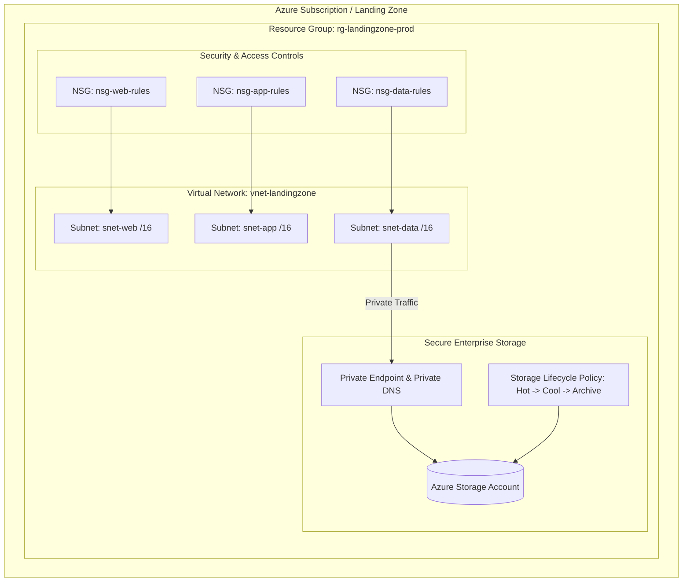

# ☁️ Modular Azure Landing Zone Terraform Infrastructure as Code (IaC)

[](https://github.com/vaibhavmahna/terraform-azure-landing-zone-blueprint/actions/workflows/ci.yml)
[](https://terraform.io)
[](https://azure.microsoft.com)
[](#)
[](LICENSE)

A production-grade, environment-agnostic **Modular Infrastructure as Code (IaC)** blueprint for provisioning secure **Microsoft Azure Landing Zones** using **Terraform v1.5+**.

---

## 🎯 Architecture Diagram



---

## ✨ Features & Architecture Highlights

- 🧩 **Modular & Reusable Architecture**: Separated into decoupled submodules (`modules/network`, `modules/security`, `modules/storage`).
- 🔐 **Zero-Trust Network Isolation**: Isolated Virtual Networks (VNets), dedicated subnets, Network Security Groups (NSGs) with default-deny inbound traffic rules.
- 💾 **Enterprise Storage Tiering**: Azure Blob Storage account configured with automated lifecycle management rules (transitions to Cool after 30 days, Archive after 90 days).
- 🛡️ **Private Endpoints**: Enforces Private Endpoint connection and Private DNS integration for Blob Storage, preventing public exposure over the internet.
- 🔒 **Remote State Management**: Parameterized backend configuration for Azure Blob Storage remote state locking.

---

## 📁 Repository Structure

```
terraform-azure-landing-zone-blueprint/
├── README.md                           # Documentation & Architecture Overview
├── main.tf                             # Root Terraform Module Configuration
├── variables.tf                        # Root Variable Declarations
├── outputs.tf                          # Root Module Outputs
├── terraform.tfvars.example            # Sample Variables File
├── modules/
│   ├── network/                        # VNet, Subnets & Routing Module
│   │   ├── main.tf
│   │   ├── variables.tf
│   │   └── outputs.tf
│   ├── security/                       # NSGs & Firewall Rule Module
│   │   ├── main.tf
│   │   ├── variables.tf
│   │   └── outputs.tf
│   └── storage/                        # Azure Blob Storage & Private Endpoint Module
│       ├── main.tf
│       ├── variables.tf
│       └── outputs.tf
└── backend/
    └── backend.tf.example              # Remote State Configuration Template
```

---

## 🚀 Quickstart Guide

### 1. Prerequisites
- [Terraform CLI `v1.5+`](https://developer.hashicorp.com/terraform/downloads) installed.
- [Azure CLI (`az`)](https://learn.microsoft.com/en-us/cli/azure/install-azure-cli) authenticated (`az login`).

### 2. Configure Local Variables

Copy the example variables file:

```bash
cp terraform.tfvars.example terraform.tfvars
```

Edit `terraform.tfvars` with your Azure region and naming prefixes:

```hcl
location            = "eastus"
environment         = "prod"
resource_group_name = "rg-landingzone-prod"
vnet_cidr           = "10.0.0.0/16"
```

### 3. Initialize & Preview

```bash
# Initialize Terraform modules & providers
terraform init

# Validate configuration syntax
terraform validate

# Perform a dry-run execution plan
terraform plan
```

### 4. Deploy Infrastructure

```bash
terraform apply -auto-approve
```

---

## 📜 License
Distributed under the **MIT License**. Free for public and commercial use.
